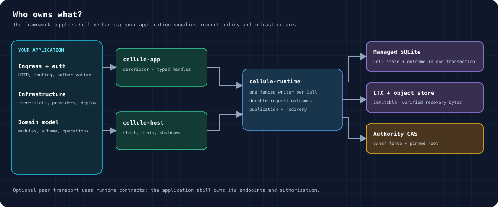
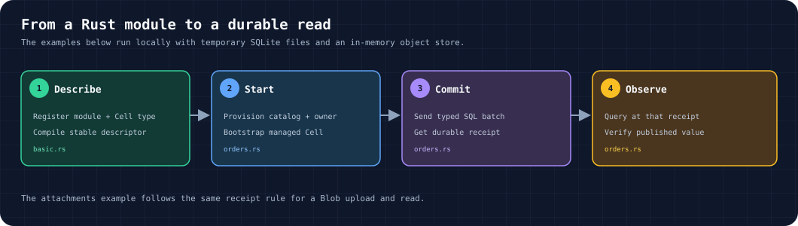
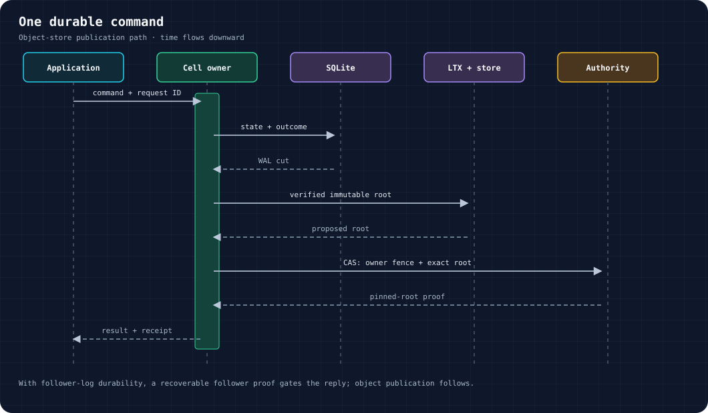

# Cellule

Cellule is an embedded Rust framework for distributed, SQLite-backed **Cells**.
An application defines typed modules and Cell topology; Cellule runs commands
through a fenced owner, publishes durable outcomes, and restores exact state.
The application owns HTTP ingress, authorization, credentials, and deployment.



| Term | Meaning |
| --- | --- |
| **Module** | Statically linked Rust code that declares schemas and operations. |
| **Cell type** | A stable namespace, role, and partition rule compiled into an application descriptor. |
| **Cell** | One addressed state partition with a single fenced writer. |
| **Receipt** | A returned observation position that a later read can require. |

## Start locally

Use Rust **1.97 or newer**. From the workspace root, run these local examples;
they use temporary SQLite files and in-memory object storage:

```sh
cargo run -p cellule-app --example basic --locked
cargo run -p cellule-app --example sql --locked
cargo run -p cellule-app --example blob --locked
cargo run -p cellule-app --example workflow --locked
cargo run -p cellule-app --example schedules --locked
```

`basic` compiles two Cell types, starts a KV Cell and a Queue Cell, then writes
and reads a setting and claims and acknowledges a job. `sql` shows SQL;
`blob` shows Blob; `workflow` runs an Activity; `schedules` fires a Cron
occurrence and delivers its Effect. Together they exercise all eight
primitives through durable commands and typed handles. No cloud credentials
are needed. Follow the
[step-by-step quickstart](docs/quickstart.md) for expected output and a local
recovery test.



## Follow one complete application path

The [runnable SQL example](crates/cellule-app/examples/sql.rs) contains
the complete local setup. It declares a SQL module and migration, compiles an
application, provisions a catalog entry and fenced owner, bootstraps a managed
Cell, invokes it through a typed handle, checks the observed row, and drains
the runtime. The snippets below are from that compiled example; keep the full
source open if you are copying them into an application.

| Stage | What the example establishes |
| --- | --- |
| Declare | `Orders` registers a SQL schema and stable command/query IDs. |
| Compile | `OrdersApp` binds the module to a `CellType`; the descriptor pins source and lockfile digests. |
| Provision | A `CellTarget`, catalog entry, authority record, and owner session identify one Cell. |
| Bootstrap | `CellRuntime` opens managed SQLite and its LTX replica before the typed client is used. |
| Invoke | A stable request ID identifies the order mutation; the returned receipt gates the read. |
| Stop | Runtime shutdown runs on both success and error paths. |

### Declare the application

`Orders` and `ORDERS` are defined in the full source. Their module descriptor
includes the schema migration and operation contracts used here:

```rust
struct OrdersApp;

impl CellApplication for OrdersApp {
    const NAME: &'static str = "orders-example";

    fn register(builder: &mut cellule_app::ApplicationBuilder) -> cellule_runtime::Result<()> {
        builder.register(Orders)?;
        builder.cell_type(CellType::new(
            Orders::NAME,
            "orders",
            ORDERS,
            CatalogRole::Sql,
            1,
        )?)?;
        Ok(())
    }
}
```

`CellApplication::compile` checks the module and topology before any Cell
starts. Stable namespace IDs, partition rules, schema versions, and operation
IDs are compatibility contracts; see the [API guide](docs/api.md) before
changing them.

### Commit and verify a receipt-bound read

This function is the example's complete application-level operation. The
caller obtains `SqlCell<Orders>` from `ApplicationHandle::<OrdersApp>` after
bootstrapping the Cell:

```rust
async fn commit_and_read_order(sql: &SqlCell<Orders>) -> ExampleResult<i64> {
    let now_ms = i64::try_from(SystemTime::now().duration_since(UNIX_EPOCH)?.as_millis())?;
    let committed = sql
        .batch(
            MutationIdentity {
                request_id: RequestId::from_bytes([6; 16]),
                issued_at_ms: now_ms,
                expires_at_ms: now_ms + 60_000,
            },
            SqlBatch {
                statements: vec![SqlStatement {
                    sql: "INSERT INTO orders (id, total_cents) VALUES (?1, ?2)".into(),
                    parameters: vec![
                        SqlValue::Integer(ORDER_ID),
                        SqlValue::Integer(ORDER_TOTAL_CENTS),
                    ],
                }],
            },
        )
        .await?;

    // The receipt requires the query to observe this published command.
    let observed = sql
        .query(
            Some(committed.receipt),
            SqlBatch {
                statements: vec![SqlStatement {
                    sql: "SELECT total_cents FROM orders WHERE id = ?1".into(),
                    parameters: vec![SqlValue::Integer(ORDER_ID)],
                }],
            },
        )
        .await?;
    let [result] = observed.output.as_slice() else {
        return Err(Error::Control("expected one order query result").into());
    };
    let [row] = result.rows.as_slice() else {
        return Err(Error::Control("expected one order row").into());
    };
    let [SqlValue::Integer(total_cents)] = row.as_slice() else {
        return Err(Error::Control("expected an integer order total").into());
    };
    if *total_cents != ORDER_TOTAL_CENTS {
        return Err(Error::Control("published order total differs").into());
    }
    Ok(*total_cents)
}
```

The request ID stays the same for retries of **this** command; a new logical
command needs a new ID. `batch` returns a `Committed` value only after the
durability gate. Passing `Some(committed.receipt)` to `query` requires the read
to observe that committed position. The function checks the actual row instead
of treating a successful transport call as proof of application behavior.

## Choose a primitive

Every primitive uses the same Cell owner, durable request outcome, publication
gate, and receipt. Choose by the shape of work, then use the typed capability
from `ApplicationHandle`:

| Primitive | Use it for | Entry point | Key rule |
| --- | --- | --- | --- |
| **SQL** | Relational state in one Cell. | `sql::<M>(target)` → `batch`, `query` | Parameterized, bounded statements; one Cell transaction. |
| **KV** | Scoped metadata and conditional updates. | `kv::<M>(namespace)` → `atomic`, `get`, `list` | Checks and mutations share one shard transaction. |
| **Blob** | Multipart content and metadata. | `blob::<M>()` → `mutate`, `query` | Stage parts, publish references, read at a receipt. |
| **Queue** | At-least-once work delivery. | `queue::<M>()` → `send`, `claim`, `ack` | Claims have tokens and leases; validate before external work. |
| **Cron** | Durable recurring schedules. | `cron::<M>()` → `mutate`, `get` | Activation is bounded and deduplicated. |
| **Workflow** | Durable, multi-step decisions. | `workflow::<M>()` → `start`, `signal`, `state` | Decisions and history survive owner changes. |
| **Activities** | External work requested by a workflow. | `activities::<M>()` → `ActivitySupervisor` | Run outside SQLite with explicit supervision and lease checks. |
| **Effects** | Delivery between Cells. | `effects::<M>(target)` → `claim`, `ack` | Source intent is durable; destination applies idempotently. |

The [example map](crates/cellule-app/docs/examples.md) explains how each
runnable path works, including the [Blob upload](crates/cellule-app/examples/blob.rs),
[Workflow activity](crates/cellule-app/examples/workflow.rs), and
[Cron effect delivery](crates/cellule-app/examples/schedules.rs). The
[application integration suite](crates/cellule-app/tests/integration.rs)
also exercises all eight primitives and recovery. Read the [primitive guide](crates/cellule-runtime/docs/primitives.md)
and [API guide](docs/api.md#primitive-capabilities) for method details and
failure behavior. Cross-Cell work uses effects and inboxes; it is not one
transaction across Cells.

## Why a successful reply survives recovery



A command stores its state change and outcome in one SQLite transaction. On
the object-store path, the owner prepares verified LTX bytes and pins the exact
root through fenced authority compare-and-swap before replying. A configured
follower-log path can acknowledge after recoverable follower proof, with object
publication following. Recovery selects the authority-pinned root and verifies
every required chunk; a bucket listing cannot choose state. If a response is
lost, resolve the original request ID before retrying. See
[architecture](docs/architecture.md) and [runtime execution](crates/cellule-runtime/docs/runtime.md).

## Go deeper

| Task | Guide |
| --- | --- |
| Run examples and a recovery test | [Quickstart](docs/quickstart.md) |
| Choose typed methods and handle outcomes | [API](docs/api.md) |
| Understand ownership, storage, and recovery | [Architecture](docs/architecture.md) |
| Embed Cellule in a serving service | [Framework integration](docs/framework.md) |
| Find the right crate or test | [Workspace reference](docs/reference.md) |
| Evaluate current support and gaps | [Roadmap](docs/roadmap.md) |
| Qualify and publish a matched crate set | [Release guide](docs/releasing.md) |

The workspace layers are `cellule-types → cellule-store → cellule-ltx →
cellule-runtime → cellule-app → cellule-host`; the optional
[cellule-peer-http](crates/cellule-peer-http/README.md) adapter uses runtime
contracts. [Contributing](CONTRIBUTING.md) lists local checks, and the
[qualification guide](crates/cellule-runtime/docs/delivery.md) separates local
tests from provider and production evidence. The dated
[verification report](docs/verification.md) and
[performance evidence](crates/cellule-app/PERFORMANCE.md) describe their
recorded revisions and environments.
