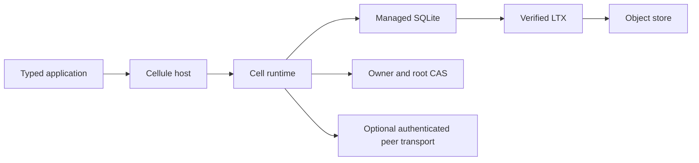
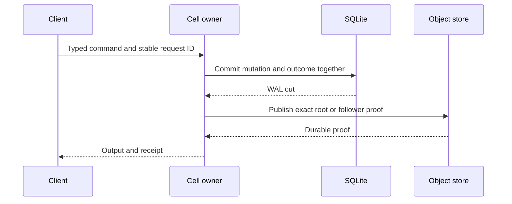

# Cellule

Cellule is an embedded Rust framework for distributed, SQLite-backed Cells.
Each Cell has one fenced writer, a durable outcome ledger, immutable LTX
history, and an exact recovery root. An application supplies ingress,
authorization, credentials, and deployment policy.



## Crates

| Layer | Crate | Read first |
| --- | --- | --- |
| Identity | [cellule-types](crates/cellule-types/README.md) | [Identity guide](crates/cellule-types/docs/README.md) |
| Transport | [cellule-store](crates/cellule-store/README.md) | [Store guide](crates/cellule-store/docs/README.md) |
| Persistence | [cellule-ltx](crates/cellule-ltx/README.md) | [LTX guide](crates/cellule-ltx/docs/README.md) |
| Execution | [cellule-runtime](crates/cellule-runtime/README.md) | [Runtime guide](crates/cellule-runtime/docs/README.md) |
| Application | [cellule-app](crates/cellule-app/README.md) | [Author guide](crates/cellule-app/docs/README.md) |
| Lifecycle | [cellule-host](crates/cellule-host/README.md) | [Host guide](crates/cellule-host/docs/README.md) |
| Optional peer adapter | [cellule-peer-http](crates/cellule-peer-http/README.md) | [Peer guide](crates/cellule-peer-http/docs/README.md) |

Dependencies point down: `host → app → runtime → ltx → store → types`.
The peer adapter uses runtime contracts without moving HTTP into lower layers.
[Architecture](docs/architecture.md) explains ownership and persisted formats.

## One durable command



Recovery selects only the authority-pinned root and verifies required bytes.
A listing or stale local database cannot choose state. See
[execution](crates/cellule-runtime/docs/runtime.md),
[storage](crates/cellule-runtime/docs/storage.md), and
[failover](crates/cellule-runtime/docs/failover-and-followers.md).

## Try the framework

Rust 1.97 or newer is required. The orders example commits and reads back a
published SQL value using local fixtures:

```sh
cargo run -p cellule-app --example orders --locked
cargo test --workspace --all-features --locked
```

The [application descriptor](crates/cellule-app/examples/application_descriptor.rs)
example shows module and Cell topology registration. The
[attachments example](crates/cellule-app/examples/attachments.rs) shows a Blob
upload and receipt-bound read.

For topology declarations and typed clients, start with the
[quickstart](docs/quickstart.md) and [application guide](crates/cellule-app/docs/README.md).
For a serving node, read [embedding](docs/embedding.md) and
[host lifecycle](crates/cellule-host/docs/lifecycle.md).

## Develop and release

Cellule is the source of truth for its Cell framework APIs and implementation.
Run the [contributor checks](CONTRIBUTING.md) after code or docs changes. The
[qualification guide](crates/cellule-runtime/docs/delivery.md) separates local
proof from provider and production evidence. The [release guide](docs/releasing.md)
lists packaging and publication gates. [LTX attribution](crates/cellule-ltx/UPSTREAM.md)
ships with the crate.

The [original synthesis overview](docs/workspace-reference.md) remains available
as historical context for the import.
