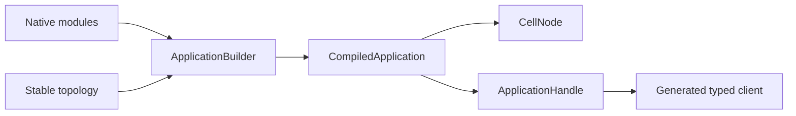

> Detailed reference preserved from the original Cellule synthesis.
> The [current crate guide](README.md) is the entry point; Crab product
> examples below describe the former application.

# cellule-app

Compile native Rust modules into one deterministic application descriptor.
Use typed handles or generated clients to address Cells and invoke registered
commands and queries. The host owns runtime lifecycle and transport wiring.



## Declare a topology

This complete example is compiled by `cargo test -p cellule-app --doc`.

```rust
use cellule_app::CellType;
use cellule_runtime::{CatalogRole, NamespaceId};

fn orders_topology() -> cellule_runtime::Result<CellType> {
    CellType::new(
        "orders",
        "orders",
        NamespaceId::from_bytes([1; 16]),
        CatalogRole::Sql,
        1,
    )?
    .with_entity_partitions()
}

assert!(orders_topology().is_ok());
```

For module descriptors, registration, KV, and Queue, run the [basic example](examples/basic.rs).
For a real command and receipt-bound read, run the [SQL example](examples/sql.rs).
For a multipart Blob write and receipt-bound read, run the [Blob example](examples/blob.rs).
For a durable activity, run the [Workflow example](examples/workflow.rs). For a
scheduled cross-Cell effect, run the [Schedules example](examples/schedules.rs).

```sh
cargo run -p cellule-app --example basic --locked
cargo run -p cellule-app --example sql --locked
cargo run -p cellule-app --example blob --locked
cargo run -p cellule-app --example workflow --locked
cargo run -p cellule-app --example schedules --locked
```

## Identity and routing contracts

| Surface | Contract |
| --- | --- |
| `ApplicationHandle::new` | Checks the application name and client registry digest before calls start. |
| `cell_client!` | Binds explicit stable namespace/operation IDs and the declared `CellKey` type. |
| Fixed shards | `CellType::new` declares a bounded shard count. |
| Entity Cells | `with_entity_partitions` requires one declared shard; typed keys derive canonical 33-byte partitions. |
| Provisioning | `CellType::entity_partition` uses the same derivation as generated clients. |
| Explicit SQL/Effects | Accept validated entity targets. |
| Namespace primitives | KV, Blob, Queue, Cron, Workflow, and Activities require fixed shards. |

Entity topology changes the descriptor. It does not split SQLite state or bypass
catalog and host admission.

## Read policies

| Operation | Routing and proof |
| --- | --- |
| Default query | `ReadPolicy::CurrentOwner` keeps owner ordering. |
| Explicit replica query | `ReadPolicy::Replica` returns an admitted snapshot's actual receipt. |
| Minimum receipt | Still checks Cell, incarnation, and sequence. |
| Missing or lagging reader | Returns `ReplicaUnavailable` or `ReplicaBehind`; no owner fallback. |
| Commands, resolution, streams, lease validation | Always retain owner ordering. |

The host wires `CellClient::with_read_replicas`, `ReplicaReadRouter`, and an
authenticated `ReplicaPeerClient`. Selection and retries share one five-second
deadline. Authors receive typed capabilities, not storage or transport handles.

## Verification map

| Test file | Evidence |
| --- | --- |
| `tests/contracts.rs` | Descriptor, digest, and identity contracts. |
| `tests/primitives.rs` | Typed primitive writes, read-back, and exact-root owner recovery. |
| `tests/host.rs` | Signed peers, duplicate results, and owner loss. |
| `tests/host/replicas.rs` | Reader recruitment, refresh, and cancellation during drain. |
| `tests/host/rollout.rs` | Additive release with retained code and recovered receipts. |
| `tests/entities.rs` | Generated entity routing and isolated request ledgers. |
| `tests/process_performance.rs` | Separate-process fleet workload; ignored unless explicitly selected. |

```sh
cargo test -p cellule-app --locked
```

The public-host fixtures share a process. RustFS, constrained containers, and
continuous-traffic rollout require the separate qualification environment.
See [PERFORMANCE.md](PERFORMANCE.md), [AGENTS.md](AGENTS.md), and the
[framework quickstart](../../docs/quickstart.md).
