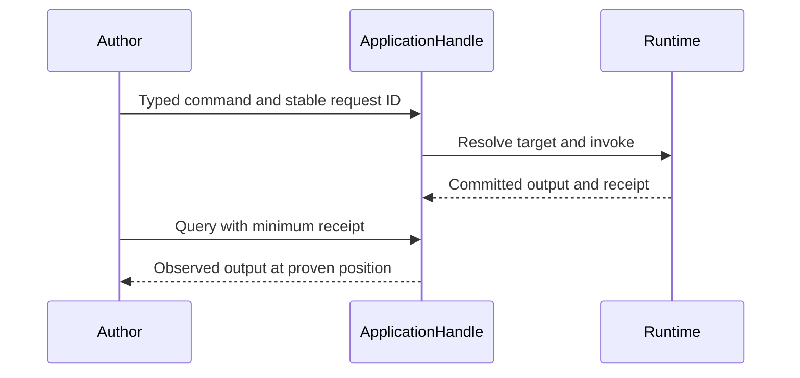

# Typed invocations and receipts

| Operation | Route and evidence |
| --- | --- |
| `ApplicationHandle::new` | Checks application identity and registry digest before calls. |
| `cell_client!` | Binds declared namespace, operation IDs, and `CellKey` type. |
| Command | Always uses current owner; durable outcome includes a receipt. |
| Default query | `ReadPolicy::CurrentOwner` preserves owner ordering. |
| Replica query | `ReadPolicy::Replica` requires an admitted reader and reports its actual receipt. |
| Resolution, stream, lease validation | Remain owner-ordered. |

A missing or lagging replica returns `ReplicaUnavailable` or `ReplicaBehind`;
the client does not silently fall back to the owner. The host installs read
replicas and the authenticated peer client. Application code sees only typed
capabilities. Run the [SQL example](../examples/sql.rs) for a command and
visible read-back.
