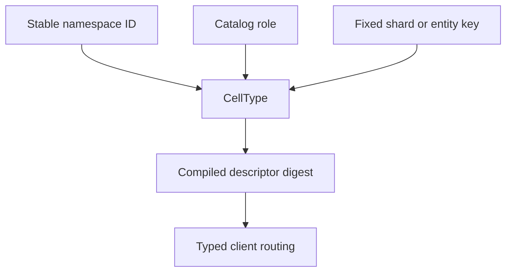

# Topology and descriptors

| Surface | Contract |
| --- | --- |
| `CellType::new` | Declares module, name, namespace, role, and shard count. |
| Fixed shards | Scope hashes to one declared shard. |
| `with_entity_partitions` | One declared shard; canonical entity key derives a 33-byte partition. |
| `CellType::entity_uuid` | SQL namespace with one declared shard; a canonical 16-byte UUID is the partition. |
| `with_schema_range` | Declares an accepted schema interval. |
| `with_limits` | Bounds database and capture sizes per Cell. |
| `ApplicationBuilder` | Freezes module registry and topology into a descriptor. |

Changing a stable namespace, role, partition scheme, or descriptor changes
routing and persisted identity. Treat it as a versioned application change.
Fixed shards use partition version 1, hashed entity keys use version 2, and
direct UUID partitions use version 3. These schemes have distinct descriptor
bytes. UUID keys must be 16 bytes with a recognized version (1 through 8)
and the RFC variant bits; generated clients route those bytes unchanged.
The [application descriptor example](../examples/application_descriptor.rs) compiles one descriptor and
prints its digest.
