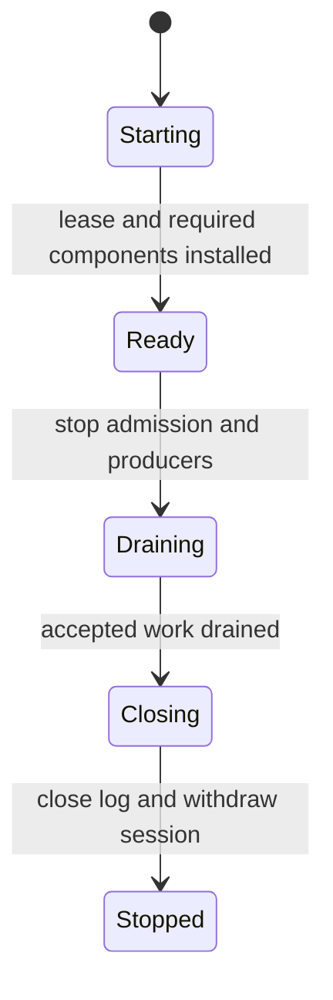

# cellule-host

`CellNode` owns one runtime, its admission ledger, facilities, and task group.
An application supplies identity, provider, ingress, and authorization.



| Guide | Topic |
| --- | --- |
| [Lifecycle](docs/lifecycle.md) | Builder, readiness, drain, and shutdown. |
| [Read replicas](docs/read-replicas.md) | Admission, recruitment, refresh, and eviction. |
| [Crate API](src/lib.rs) | Exported node and facility types. |

```sh
cargo test -p cellule-host --locked
```
