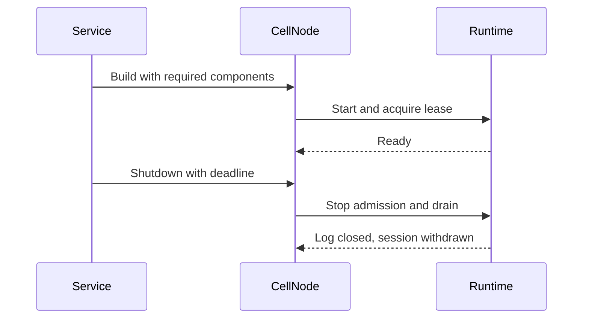

# Node lifecycle

| Component | Responsibility |
| --- | --- |
| `CellNodeBuilder` | Validate dependencies before starting runtime. |
| `CellNodeTaskGroup` | Bound and supervise ordinary tasks and lease maintenance. |
| `CellNode` | Report readiness, status, and shared runtime metrics. |
| Facilities | Register owned components before readiness. |
| Drain | Stop admission, finish accepted work, then close the node log. |
| Scale down | Serialize releases with shutdown through one drain lane. |

A deadline bounds releases started after acquiring the drain lane; it does not
bound waiting for that lane. Fleet-level pacing stays in the movement planner.
The node retains lease maintenance while accepted work and covered log tails
are drained. See [the embedding guide](../../../docs/embedding.md) for service
startup order.
