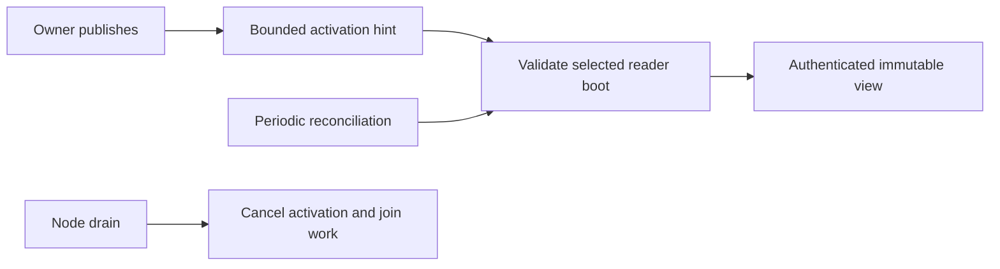

# Read replica lifecycle

| Boundary | Behavior |
| --- | --- |
| Memory | Snapshot reservations are separate from writer memory. |
| Installation | Manager starts after the node task group; dispatcher uses the same resolver. |
| Recruitment | Locally owned Cells send scoped hints through an authorized peer client. |
| Refresh | New view must prove its root and receipt before selection. |
| Missing reader | Queries return a replica error; they do not trigger activation. |
| Drain | Cancels activation before closing views. |

Commands do not wait for readers. Reconciliation repairs dropped hints and
membership changes; it is not a freshness guarantee. See
[application read policies](../../cellule-app/docs/invocation.md).
