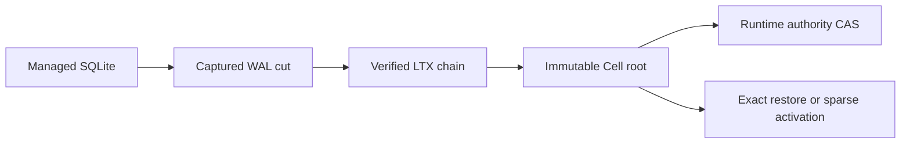

# cellule-ltx

Managed SQLite WAL capture and exact, checksum-verified LTX recovery. The
optional `replica` feature adds immutable Cell roots, object-store transport,
compaction, and sparse paged SQL.



| Guide | Topic |
| --- | --- |
| [Local capture](docs/capture.md) | `Db`, transactions, cuts, checkpoints, and barriers. |
| [Root publication](docs/publication.md) | Immutable preparation versus authoritative selection. |
| [Recovery](docs/recovery.md) | Verified plans, exact restore, and sparse activation. |
| [Safety and limits](docs/safety.md) | Failure classes, resources, and verification. |
| [Provenance](UPSTREAM.md) | Celld lineage and retained licenses. |

## Local round trip

This example is compiled as a doc test. The destination is fresh.

```rust,no_run
use cellule_ltx::{Db, Limits, VerifiedPlan, restore_exact};

fn main() -> cellule_ltx::Result<()> {
    let source = tempfile::tempdir()?;
    let restored = tempfile::tempdir()?;
    let limits = Limits::default();
    let database_path = source.path().join("cell.sqlite");

    let mut database = Db::open(&database_path, limits)?;
    database.transaction(|transaction| {
        transaction.execute("CREATE TABLE items (id INTEGER PRIMARY KEY)", [])?;
        transaction.execute("INSERT INTO items VALUES (1)", [])?;
        Ok(())
    })?;

    let captured = database.capture()?;
    let plan = VerifiedPlan::new(&captured.segments, captured.position, limits)?;
    let restored_path = restored.path().join("cell.sqlite");
    assert_eq!(restore_exact(&plan, &restored_path)?, captured.position);
    database.close()?;
    Ok(())
}
```

`Db::transaction` commits locally. A distributed write is acknowledged only
after the owning runtime proves the selected root or follower-log durability.

```sh
cargo test -p cellule-ltx --locked
cargo test -p cellule-ltx --features replica --locked
cargo run -p cellule-ltx --example local_roundtrip --locked
```
