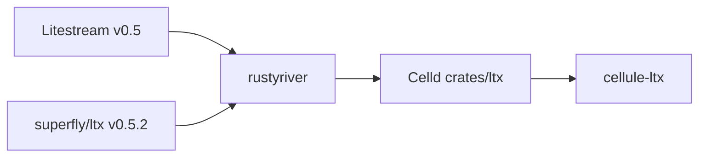

# Source lineage and licenses

`cellule-ltx` contains adapted Apache-2.0 code, not a floating dependency or
vendor mirror. Cellule owns the implementation and its future changes. This
record preserves the original sources and compatibility boundary.

| Source | Revision or version | Role |
| --- | --- | --- |
| [Celld](https://github.com/denoland/celld/tree/10cb1303dac710dcb3b557e318e08c855261f68b/crates/ltx) | `10cb1303dac710dcb3b557e318e08c855261f68b`, imported 2026-09-13 | Direct Rust source snapshot. |
| [rustyriver](https://github.com/mikenomitch/rustyriver) | 2026-08-03 Celld snapshot | Earlier Rust LTX implementation. |
| [superfly/ltx](https://github.com/superfly/ltx/tree/v0.5.2) | v0.5.2 | Wire-format reference. |
| [Litestream](https://github.com/benbjohnson/litestream/releases/tag/v0.5.17) | v0.5.17 comparison | Decoder behavior reference, not shared replica protocol. |

## Attribution

| Work | Copyright / attribution | License |
| --- | --- | --- |
| Celld | Celld contributors | Apache-2.0 |
| rustyriver | The rustyriver authors, 2026 | Apache-2.0 |
| Litestream | Ben Johnson and contributors | Apache-2.0 |
| LTX reference | Superfly, Inc. | Apache-2.0 |
| LZ4 block implementation | Pierre Curto, 2015 | BSD-3-Clause |

Ship both [LICENSE](LICENSE) and
[LICENSE.pierrec-lz4](LICENSE.pierrec-lz4) with source and binaries. The
pinned Celld subtree has no `NOTICE`; no Tokio runtime source was copied.

## Cellule changes

| Area | Current contract |
| --- | --- |
| SQLite | Managed writer, WAL observation, fresh local session, exact capture. |
| Recovery | Explicit verified plan or authority-pinned root; no latest-object listing. |
| LTX | Checksum-bearing v3 files; strict page and rolling-checksum validation. |
| Cell objects | Immutable roots, directories, bundles, and BLAKE3 expectations. |
| Errors | Typed retry, capacity, permanent, ambiguous, and fenced classes. |
| Resources | Bounded file, disk, I/O, scratch, and blocking-job admission. |

The old standalone epoch-head, public page-map, and scheduler layouts are not
read. The one-time Crab-to-Cellule adaptation is recorded in the
[historical import record](../../docs/synthesis.md); it does not set future
framework policy.

## Compatibility boundary

A current Litestream decoder can understand checksum-bearing LTX v3 files in
the v0.5.2 sized-block representation. This does **not** make Cell roots,
authority records, object paths, CRB1 bundles, BLAKE3 manifests, or retention
policies compatible. The older checksummed LZ4-frame encoding remains a
reader input; checksum-disabled files and zero-checksum continuation markers
are rejected.

## Future imports

Review any Celld or LTX change against Cellule's writer, restore, compaction,
provider, and failure callers. Check notices and licenses. Run real SQLite,
malformed-input, external-vector, process-kill, and sparse-root tests before
claiming compatibility. Cellule's repository remains the authority for its
public API and persistence contracts.
