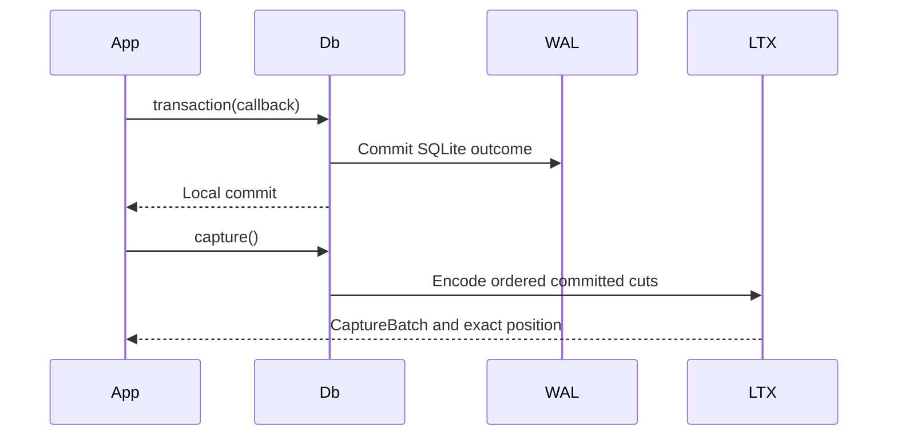

# Managed capture

`Db` owns one exclusive SQLite writer plus its capture session. Use a fresh
metadata directory; no external writer may change the database or retained
LTX files.

| API | Boundary |
| --- | --- |
| `Db::open` | Claims a fresh managed session. |
| `Db::transaction` | Commits one local transaction; no remote durability claim. |
| `Db::transaction_with` | Preserves application rejection separately from capture/commit errors. |
| `Db::capture` | Returns ordered cuts and a verified position after local barrier. |
| `Db::capture_deferred` | Returns readable cuts with pending local durability. |
| `Db::durability_barrier` | Flushes pending cuts and their directory chain. |
| `Db::checkpoint` | Captures the boundary before SQLite checkpoint. |
| `Db::snapshot` | Builds an independent full image. |

A single delta too large for `max_capture_bytes` becomes a full image bounded
by `max_file_bytes`. The committed transaction is never silently omitted from
the lineage. Deferred capture must cross its barrier or a published-root proof
before acknowledgement.

Run [the local example](../examples/local_roundtrip.rs) to see write, capture,
source removal, restore, and read-back.
