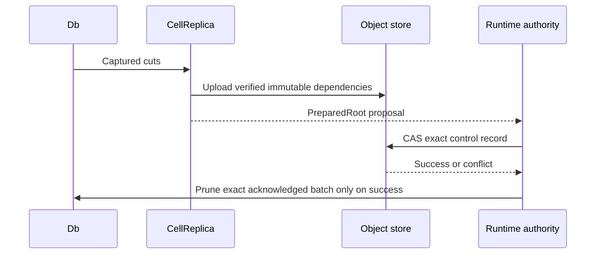

# Immutable root publication

The `replica` feature prepares Cell-scoped objects. Preparation does not grant
a lease or make a root authoritative.

| Step | Contract |
| --- | --- |
| `CellReplica::prepare` | Verifies cuts and writes immutable root dependencies. |
| `prepare_bundle` | Selects this Cell's exact rows from a shared bundle. |
| `prepare_compaction` | Rewrites representation without changing logical state. |
| Runtime CAS | Names the authoritative owner and exact root. |
| `Db::prune_captured` | Removes only the successfully published batch. |

A failed CAS leaves unreachable content, never an acknowledged state. Provider
retry pins and rechecks the selected capture bytes, so path replacement cannot
change an in-flight proposal. The host owns request admission, deadlines, and
reconciliation after ambiguous results.
