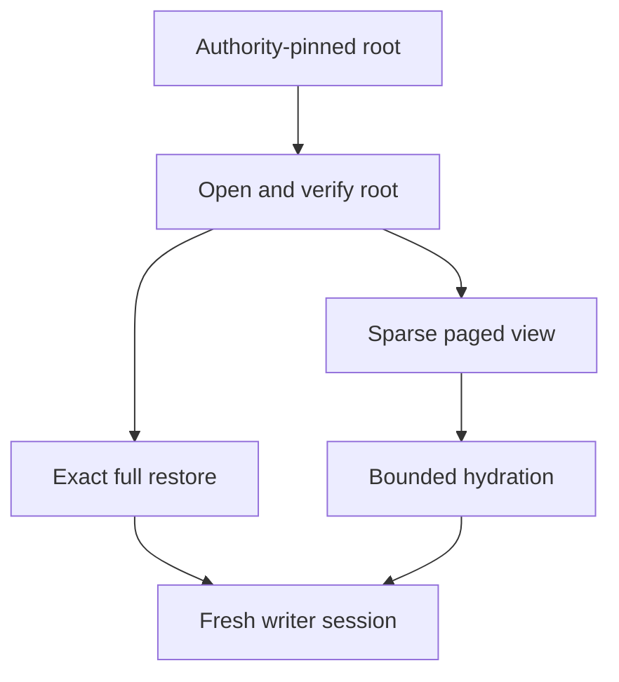

# Exact recovery and sparse activation

| API | Guarantee |
| --- | --- |
| `VerifiedPlan::new` | Verifies a complete ordered snapshot-plus-delta chain and owns the reconstructed image. |
| `restore_exact` | Creates a fresh destination at the requested endpoint; never overwrites. |
| `compact_exact` | Writes a verified full snapshot without deleting inputs. |
| `CellReplica::open_root` | Verifies Cell scope, metadata, chain, and directory. |
| `VerifiedRoot::restore` | Streams the exact root into a fresh destination. |
| `VerifiedRoot::paged` | Authenticated page and page-run reads. |
| `Db::resume` | Continues a verified lineage in a fresh session. |
| `Db::open_resumed` | Continues a clean local image without origin read. |

Sparse writable activation starts at the pinned root's exact position.
`prepare_hydration`, authenticated fetch, and `install_hydration` separate
network I/O from the SQLite worker. Installation checks that the activation is
still current; stale work cannot overwrite newer pages.

A bucket listing is never a recovery selector. Runtime authority supplies the
root, and reconstruction either matches it byte-for-byte or fails.
