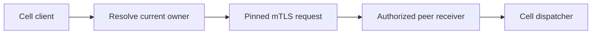

# cellule-peer-http

Optional HTTP transport for authenticated Cell peers. The application
owns ingress, enrollment, authorization, and credential lifecycle.



| Guide | Topic |
| --- | --- |
| [Routing and outcomes](docs/routing.md) | Owner lookup, retries, and deadlines. |
| [Security boundary](docs/security.md) | mTLS pins, scope, and receiver checks. |
| [Crate API](src/lib.rs) | Transport traits and implementation. |

```sh
cargo test -p cellule-peer-http --locked
```
