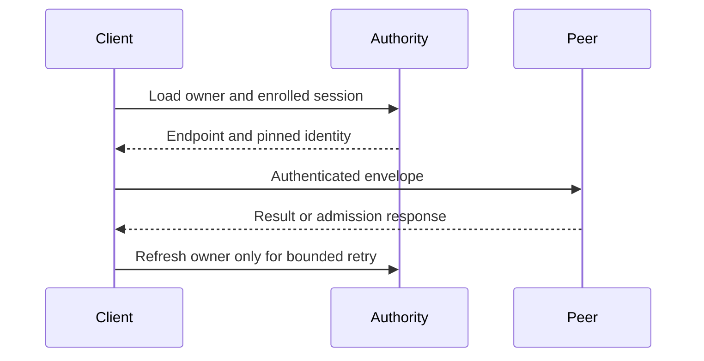

# Routing and outcomes

`PeerHttpRoundTrip` resolves the currently enrolled owner, sends one signed
envelope, and bounds request and response bytes. Both owner-routed and
direct-node calls reject oversized requests and zero deadlines before lookup.

| Response | Meaning |
| --- | --- |
| Valid reply | Return the exact peer result. |
| 429/503 with integer `Retry-After` | Pace one owner-route retry within the original deadline. |
| Persistent admission rejection | Return capacity error. |
| Lost or invalid response | Return unknown outcome; caller reconciles. |
| Direct-node activation | One attempt; caller owns scheduling/retry. |

The same timeout governs resolution, sending, and pacing. A delay that consumes
the budget returns a deadline error without sleeping. Other invalid results
are never guessed to have failed before execution.
