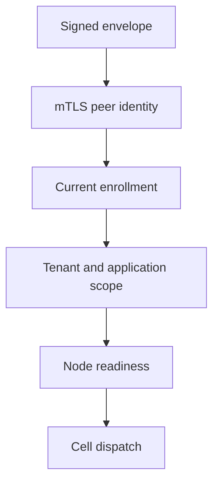

# Peer security boundary

| Participant | Required check |
| --- | --- |
| `PeerTargetScope` | Target belongs to the routed application and tenant. |
| `PeerHttpClientFactory` | Local client identity; pin remote certificate and public key. |
| Receiver | Verify envelope signature, enrollment, product authorization, and readiness. |
| Dispatcher | Execute only after receiver checks; keep request bounds. |

The private forwarding path is `internal/cells/v1/forward`. Install it only
inside the embedding service's authenticated peer ingress. This library does
not discover credentials or authorize external users.

Local HTTP fixtures test retry and outcome classification. They do not prove a
production certificate rotation or fleet enrollment deployment; qualify those
in the embedding service.
