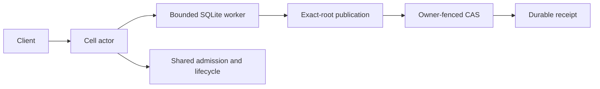

> Detailed reference preserved from the original Cellule synthesis.
> The [current crate guide](README.md) is the entry point; Crab product
> examples below describe the former embedding service.

# cellule-runtime

Embedded SQLite Cell runtime for embedding services: Cell identities, control/CAS
authority, one single-writer actor per Cell, schema installation, exact-root
LTX publication, follower durability, fleet placement, and qualification
receipts. The embedding service owns HTTP ingress, authentication, and provider
construction.

An opt-in library read path can open an exact S3-rooted, read-only Cell view
through `CellReadReplica`. Its view and replacement refresh are charged to the
node runtime's memory, descriptor, and disk ledgers. The charges are provisional;
product routing and measured capacity qualification remain open under
[Plan 036](https://github.com/crabbuild/crab/blob/beb439039cb37e750afe6625a2358101c70d1191/advisor-plans/036-cell-read-replicas-and-fenced-promotion.md).



## Module map

| Module | Responsibility |
| --- | --- |
| `identity` | Cell, tenant, session, namespace, node, and digest identities |
| `control` | Control record, transitions, and CAS authority |
| `codec` | Bounded wire codec used by modules and peers |
| `registry` | Module/command/query descriptors and the compiled registry |
| `cell` | Actor, executor, worker pool, catalog, schema, application identity |
| `client` | Typed client, prepared commands, state streams |
| `primitives` | SQL, KV, Blob, Queue, Cron, Workflow, Effects, activity pool |
| `publication` | Exact-root LTX publication |
| `follower` | Follower store, lanes, and tail pages |
| `node` | Signed advertisements, node log, recovery, durability, leases |
| `recovery` | Recovery manifests, artifacts, releases, pins, retention |
| `fleet` | Placement, pressure, admission accounting, eviction, scheduling |
| `peer` | Authenticated peer protocol |
| `qualification` | Qualification profiles, workloads, and receipts |
| `ltx` | LTX types this crate exposes to embedders |

The root also re-exports a small prelude for embedders, frozen in
[`api-prelude.txt`](api-prelude.txt).

## Tests

`tests/` holds one binary per suite (`runtime`, `primitives`, `protocol`,
`contracts`, `fleet`, `qualification`) with shared fixtures in
`tests/support/`. Modules whose tests must assert crate-private behavior are
recorded in the retired `tests-allow-list.txt` inventory. Current module
ownership is checked by [`check-module-layout.py`](../../scripts/check-module-layout.py).

```sh
CARGO_TARGET_DIR=$HOME/Workspace/crabbuild-target/<checkout> \
  cargo test -p cellule-runtime --features test-support --locked
```

See `docs/README.md` for the runtime design and `AGENTS.md` for contributor
rules.
