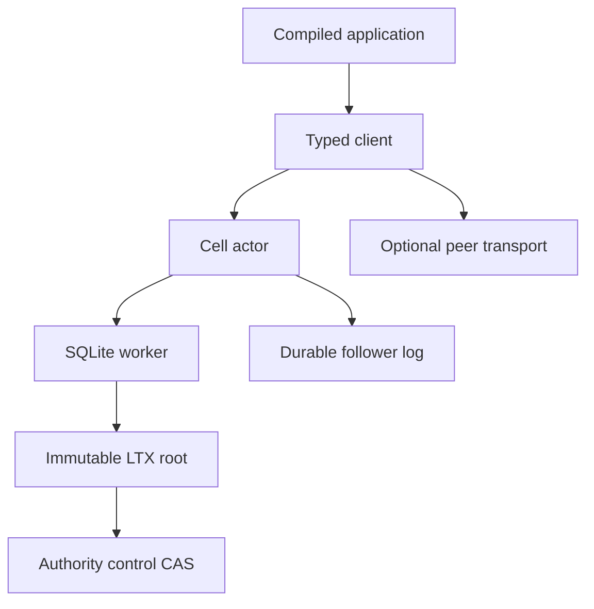

# Runtime guide

Cellule owns the reusable Cell framework. A service supplies identity,
ingress, authorization, credentials, and deployment policy.

| Topic | Guide | Owning module |
| --- | --- | --- |
| Request path and receipts | [Execution](runtime.md) | `src/cell`, `src/client`, `src/publication`. |
| Control, roots, and recovery | [Storage](storage.md) | `src/control`, `src/recovery`, `cellule-ltx`. |
| SQL and distributed primitives | [Primitives](primitives.md) | `src/primitives`, `src/registry`. |
| Follower durability and owner loss | [Failover](failover-and-followers.md) | `src/follower`, `src/node`. |
| Native authoring | [Rust API](rust-api.md) | `src/registry`, `cellule-app`. |
| Service integration | [Embedding](deployment.md) | `cellule-host`, optional peer adapter. |
| Test and evidence levels | [Qualification](delivery.md) | `tests/`, `qualification/`, model. |

Contracts: [SQLite schema](contracts/runtime.sql),
[peer wire format](contracts/peer.proto), and
[contract validator](validate.mjs). The [crate entry](../README.md) has the
workspace commands.
