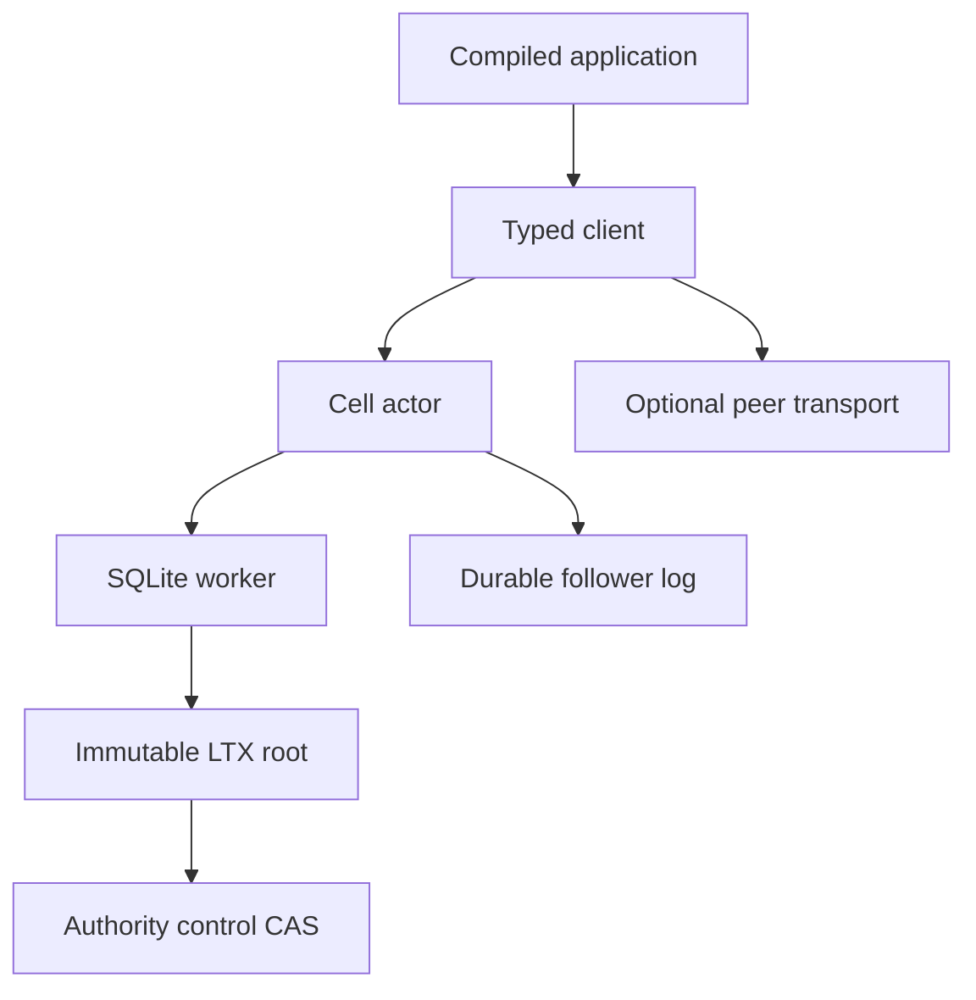

# Runtime guide

Cellule owns the reusable Cell framework. A service supplies identity,
ingress, authorization, credentials, and deployment policy.

| Topic | Start here | Full technical detail |
| --- | --- | --- |
| Request path and receipts | [Execution](runtime.md) | [Actor, deadlines, takeover, and drain](runtime-detailed.md) |
| Control, roots, and recovery | [Storage](storage.md) | [Identity, layouts, pages, backup, and retention](storage-detailed.md) |
| SQL and distributed primitives | [Primitives](primitives.md) | [Procedures, limits, and examples](primitives-detailed.md) |
| Follower durability and owner loss | [Failover](failover-and-followers.md) | [Node logs, proof, and recovery](failover-and-followers-detailed.md) |
| Native authoring | [Rust API](rust-api.md) | [Registration, codecs, contexts, and activities](rust-api-detailed.md) |
| Service integration | [Deployment](deployment.md) | [Fleet, release, drain, and operations](deployment-detailed.md) |
| Test and evidence levels | [Qualification](delivery.md) | [Proof matrix and receipts](delivery-detailed.md) |

The detailed references retain the framework mechanics and examples from the
original synthesis. Mentions of Crab HTTP routes or deployment are historical
embedding examples, not Cellule requirements. The [technical reference map](technical-reference.md)
also links the original design and audit records.

Contracts: [SQLite schema](contracts/runtime.sql),
[peer wire format](contracts/peer.proto), and
[contract validator](validate.mjs). The [crate entry](../README.md) has the
workspace commands.
