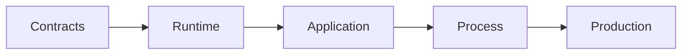

# Verification and qualification

A feature is useful when a typed action creates a real side effect and a
subsequent read observes it. Mocked unit checks alone do not prove wiring.

| Level | Evidence | Primary suite |
| --- | --- | --- |
| Contracts | Stable IDs, schemas, codecs, and transition invariants. | `tests/contracts.rs`, `docs/validate.mjs`. |
| Runtime | Actor, publication, recovery, and primitive behavior. | `tests/runtime.rs`, `tests/primitives.rs`. |
| Fleet | Enrollment, follower proof, owner loss, and placement. | `tests/fleet.rs`, `tests/protocol.rs`. |
| Application | Typed call → durable result → read-back. | `cellule-app/tests/integration.rs`. |
| Process | Separate nodes with an object store. | Ignored three-process reference smoke. |
| Production | Fault, load, provider, security, and rollout evidence. | Separate controlled environments. |



```sh
cargo test -p cellule-runtime --features test-support --locked
python3 scripts/check-boundaries.py
python3 scripts/check-module-layout.py
node crates/cellule-runtime/docs/validate.mjs
```

The commands run from the workspace root. The [qualification harness](../qualification/README.md)
separates local contracts from provider and multi-process gates.

| Automated route | What it proves |
| --- | --- |
| [Qualification contract](../../../.github/workflows/qualification-contract.yml) | Profiles, receipts, runtime and LTX contracts. |
| [Coordination model](../../../.github/workflows/coordination-model.yml) | Replayable kernel decisions and model checks. |
| [Property qualification](../../../.github/workflows/property-qualification.yml) | Deeper scheduled runtime and LTX property searches. |
| [LTX fuzz](../../../.github/workflows/ltx-fuzz.yml) | Decoder vector replay and scheduled fuzz searches. |
| [Reference Compose](../../../.github/workflows/reference-compose.yml) | Typed application actions across constrained nodes and object storage. |

The Compose run provides local provider and process evidence. Protected cloud
provider and fault qualification still needs its named environment and signed
evidence; it is not implied by a green Compose run.

For test matrix, receipts, provider qualification, and evidence gates, read the [detailed reference](delivery-detailed.md).
