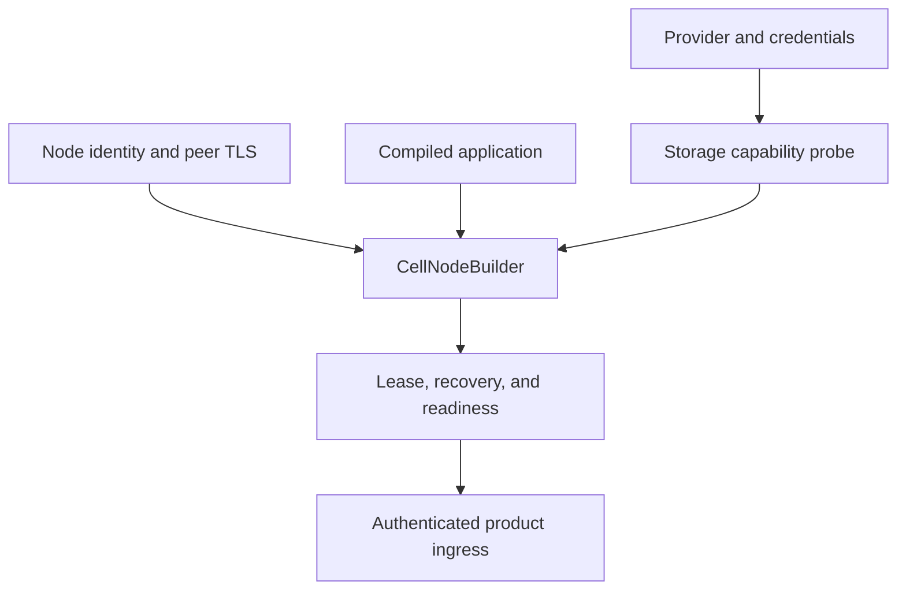

# Embed and operate Cellule

The service owns providers, authentication, ingress, tenant authorization,
secrets, and deployment. Cellule owns reusable execution and node lifecycle.

| Before readiness | Owner |
| --- | --- |
| Validate conditional writes and ranged reads | Application with `cellule-store` probe. |
| Freeze application descriptor and compatible release | `cellule-app` and service. |
| Install authority, follower store, node log, limits, and peer transport | Service through `cellule-host`. |
| Recover pinned state and acquire lease | Runtime and host. |
| Advertise endpoint and capacity | Host and service. |

A request may enter any healthy node. The client dispatches locally when this
node owns the Cell, otherwise through an authenticated peer. Shutdown stops
admission first, drains accepted work while maintaining coverage, then
withdraws the node session.

Configuration is an application contract. Cellule does not provide a
Kubernetes chart or product HTTP routes. See [host lifecycle](../../cellule-host/docs/lifecycle.md),
[peer security](../../cellule-peer-http/docs/security.md), and the
[workspace embedding guide](../../../docs/embedding.md).

For fleet sizing, rollout, drain, and observation detail, read the [detailed reference](deployment-detailed.md).
