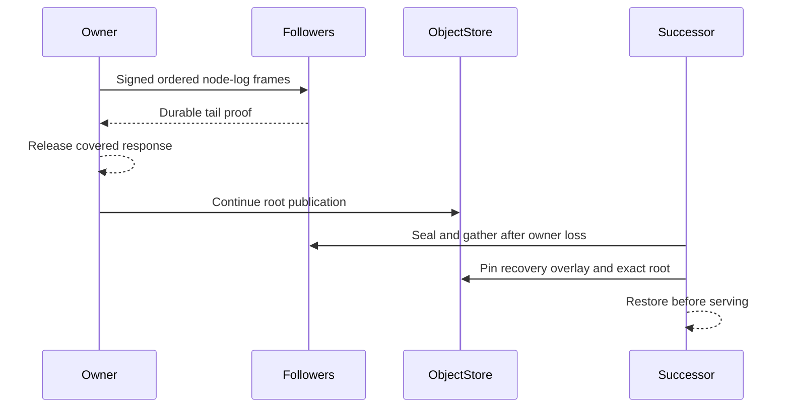

# Follower durability and owner loss

A write may be released after exact object-root publication or after the
selected followers have durably stored its node-log tail. The latter remains
recoverable before a successor serves the Cell.

| Event | Required action |
| --- | --- |
| Normal publication | CAS an exact immutable root and advance the covered sequence. |
| Fleet-only acknowledgement | Retain enough durable follower tail for recovery. |
| Owner loss | Fence old session, seal/gather selected tails, and pin overlay. |
| Successor activation | Verify root plus uncovered tail before accepting work. |
| Graceful drain | Stop admission, finish accepted work, close log, withdraw session. |

Node advertisements bind a session, release, certificate, and capacity.
Follower selection and replacement must use current enrollment. An absence
proof is not inferred from a missing object listing. See
[`src/node`](../src/node) and [`src/follower`](../src/follower) for implementation,
and [qualification](delivery.md) for failure tests.
