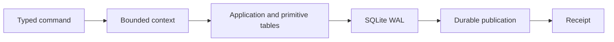
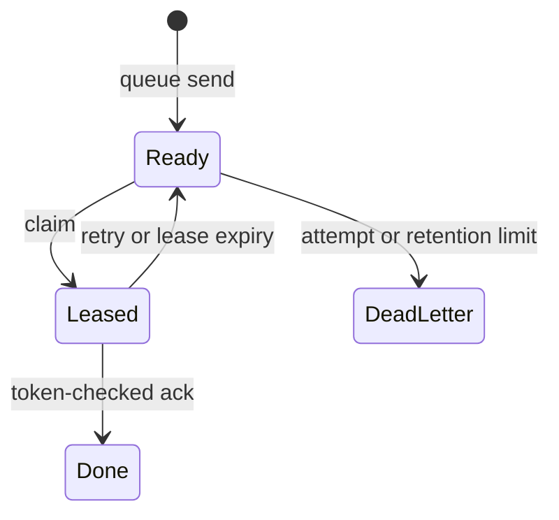

# Cell primitives

All primitives use the same actor, request ledger, SQLite transaction, LTX
capture, publication gate, and receipt. Cross-Cell work uses durable effects
and idempotent destination inboxes, never a distributed SQL transaction.

| Primitive | Use | Key behavior |
| --- | --- | --- |
| SQL | Relational state in one Cell. | Bounded parameterized statements and result rows. |
| KV | Scoped atomic metadata. | Checks before mutations; versioned values and expiry. |
| Blob | Large immutable content. | Stage content, publish references, then safe cleanup. |
| Queue | At-least-once messages. | Claim leases and token-checked ack/extend/retry. |
| Workflow | Durable decisions across steps. | Recorded outcomes and scheduled activities. |
| Activity | External work. | Explicit supervisor, lease, retry, and resolution. |
| Cron | Due recurring work. | Bounded scheduler activation and deduplicated ticks. |
| Effects | Cross-Cell delivery. | Durable source intent and destination inbox. |

Application SQL cannot access reserved `sys_`, `kv_`, `blob_`, `queue_`,
`cron_`, and `workflow_` tables directly. Primitive modules install their own
schemas and expose typed capabilities through the registry. See
[the application guide](../../cellule-app/docs/README.md) for an author-facing
example and [contract SQL](contracts/runtime.sql) for storage inputs.
