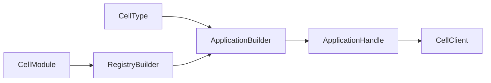

# Native Rust authoring

Register statically linked modules, stable operation IDs, codecs, and a Cell
topology before host readiness. An author handle exposes typed commands and
queries; it does not expose raw SQLite, authority, or provider credentials.



| Author decision | Contract |
| --- | --- |
| Module and operation IDs | Stable across compatible releases. |
| Input/output codecs | Bounded and versioned. |
| Cell topology | Fixed shard or entity partition; descriptor digest changes on edits. |
| Command | One Cell transaction and durable result. |
| Query | Owner-ordered or explicit admitted-replica read. |
| Activity | External work outside the SQLite transaction, supervised explicitly. |

```rust
use cellule_runtime::{ApplicationId, NamespaceId, TenantId};

let tenant = TenantId::from_bytes([1; 16]);
let application = ApplicationId::from_bytes([2; 16]);
let namespace = NamespaceId::from_bytes([3; 16]);
assert_ne!(tenant.as_bytes(), application.as_bytes());
assert_eq!(namespace.as_bytes().len(), 16);
```

Use the current [Cellule API guide](../../../docs/api.md) for application
composition, typed capabilities, receipts, and outcome handling. The compiled
[application topology example](../../cellule-app/README.md) and
[orders command example](../../cellule-app/examples/orders.rs) show complete
registration and read-back. The application decides HTTP and user policy;
no primitive is a public network endpoint by itself.

For registry, codec, context, client, and activity APIs, read the [detailed reference](rust-api-detailed.md).
