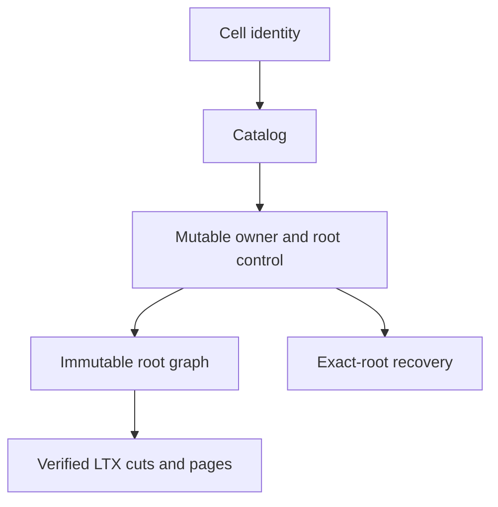

# Authority, storage, and recovery

Cell identity binds tenant, application, namespace, and partition. The catalog
records admitted Cells; the mutable control record names one owner session and
one exact root. Object listings are not authority.

| Surface | Contract |
| --- | --- |
| Catalog | Admit and discover Cells within application scope. |
| Control | CAS owner, epoch, and exact root; stale writers fence. |
| Immutable root | Scope and authenticate referenced LTX and directory objects. |
| Backup | Pin one exact application boundary. |
| Retention | Keep referenced and grace-period objects; delete only after proof. |
| Recovery | Verify every required object before serving. |

A prepared root is a proposal. A successful control CAS makes it authoritative;
a conflict fences the old owner. Failed or abandoned proposals may leave
unreachable content, which retention later handles without deleting referenced
objects.

Sparse reads authenticate pages under the pinned root. A fresh writer may
hydrate missing pages in bounded steps, but cannot use stale activation work.
See [cellule-ltx recovery](../../cellule-ltx/docs/recovery.md) for the LTX
mechanics and [cellule-store](../../cellule-store/docs/README.md) for provider
transport.

For object layouts, immutable graph limits, backup, and retention contracts, read the [detailed reference](storage-detailed.md).
