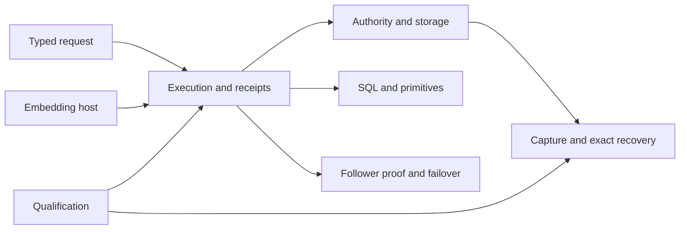

# Technical reference map

The short [runtime guide](README.md) is a route into the full documentation.
These references retain limits, failure paths, examples, and design reasoning
from the Cellule synthesis. Current contracts are owned by Cellule source and
tests. Crab-specific HTTP routes and operations in older references describe
the former embedding service.

| Framework topic | Detailed reference |
| --- | --- |
| Runtime overview and ownership | [Original detailed overview](overview-detailed.md) |
| Actor, SQL worker, deadlines, and drain | [Execution](runtime-detailed.md) |
| IDs, control, immutable roots, pages, backups, and retention | [Storage](storage-detailed.md) |
| SQL, KV, Blob, Queue, Cron, Workflow, and Effects | [Primitives](primitives-detailed.md) |
| Node logs, follower proof, owner loss, and recovery | [Failover and followers](failover-and-followers-detailed.md) |
| Native modules, codecs, and client calls | [Rust API](rust-api-detailed.md) |
| Node setup, routing, release, and observation | [Deployment](deployment-detailed.md) |
| Tests, receipts, and qualification levels | [Delivery](delivery-detailed.md) |

## Design and audit records

These pages preserve the original design context and measured evidence. They
are useful when changing an invariant, but dated plans and product-specific
commands are not current deployment instructions.

| Record | Scope |
| --- | --- |
| [Application framework](application-framework.md) and [worked example](application-framework-example.md) | Original module and API design. |
| [Canonical LTX scaling](canonical-ltx-scaling.md) | Scaling and publication design. |
| [LTX performance audit](ltx-performance-audit.md) | Measurements, bottlenecks, and follow-up evidence. |
| [Standalone replication audit](standalone-replication-audit.md) | Replication behavior review. |
| [Writable VFS and LTX scale plan](vfs-ltx-scale-plan.md) | Sparse writable activation design. |
| [Original system architecture diagram](diagram/system-architecture.svg) | Historical Crab embedding view. |
