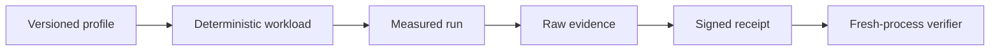

# Runtime qualification

Profiles in [`profiles/`](profiles/) are versioned threshold inputs. Receipts
bind a profile digest, source revision, image digest, measured artifact, and
execution evidence. A generated workload is a test input, not a protected
production receipt.



| Tier | Use | Evidence boundary |
| --- | --- | --- |
| `pr-contract-v1` | Local contract validation. | Synthetic or local evidence; no production claim. |
| `local-provider-v1` | Provider contract checks. | Conditional, range, and multipart observations. |
| `scale-v1` | Bounded Cell population and resource counters. | Measured fleet samples. |
| `compatibility-v1` | Release and persisted-state compatibility. | Explicit upgrade/rollout run. |
| `provider-*-v1`, `fault-*-v1` | Cloud and failure matrix. | Real provider/fault artifacts. |

## Generate a local workload

Run from the workspace root:

```sh
cargo run -p cellule-runtime --bin qualification_receipt --locked -- \
  workload workload.json crates/cellule-runtime/qualification/profiles/pr-contract-v1.json 7
cargo run -p cellule-runtime --bin qualification_receipt --locked -- \
  verify-workload workload.json crates/cellule-runtime/qualification/profiles/pr-contract-v1.json
```

`emit` cannot mint a protected receipt. Protected evidence must come from a
measured adapter and be bound with `bind-protected`; the signing key stays
outside the evidence directory. `verify-protected-bundle` requires the full
provider, scale, compatibility, and fault matrix with a trusted signer and
freshness checks. No local smoke substitutes for those inputs.

## Test routes

| Route | Location |
| --- | --- |
| Pure coordination model | [`model/README.md`](../model/README.md) |
| Runtime integration suites | [`tests/qualification.rs`](../tests/qualification.rs) |
| Public typed end-to-end | [`cellule-app` reference suite](../../cellule-app/tests/reference_application.rs) |
| One-vCPU sparse worker diagnostic | [Worker profile](worker-profile.md) |
| Application process/reader scenarios | [`cellule-app` performance guide](../../cellule-app/PERFORMANCE.md) |

A passing local run proves only its selected path. Record provider, topology,
resource limits, binary identity, source revision, raw logs, and the exact
selector for every claim. The [verification guide](../docs/delivery.md) lists
proof levels and ownership.
