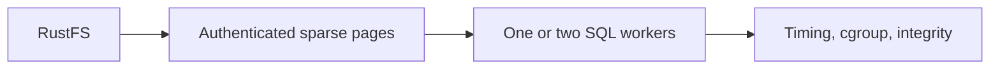

# One-vCPU sparse worker diagnostic

This optional Compose profile compares one and two SQL workers under the same
one-vCPU, 1-GiB limit against a disposable RustFS bucket. It measures sparse
read interference; it does not establish application latency or a protected
release receipt.

| Case | Exact test selector |
| --- | --- |
| `single` | `cell::worker::tests::rustfs_single_worker_reports_sparse_read_interference` |
| `paired` | `cell::worker::tests::rustfs_sparse_reads_report_worker_interference` |



Run from a committed Cellule revision and a fresh external state directory.
The state directory must be writable inside the chosen Docker context; a
host-only mount is insufficient.

```sh
export CELLULE_WORKER_STATE=$(mktemp -d "$HOME/Workspace/crabbuild-target/cellule-worker-XXXXXX")
mkdir -p "$CELLULE_WORKER_STATE"/{source,target-linux,evidence}
git archive HEAD | tar -x -C "$CELLULE_WORKER_STATE/source"
docker compose -f crates/cellule-runtime/qualification/worker-profile.compose.yaml config --quiet
```

Build the `build` service, initialize `rustfs` and `bucket-init`, then run
`worker single` and `worker paired` serially. Retain the exact test logs,
container inspect data, source SHA, binary SHA-256, and cgroup counters. The
runner fails if the selector executes zero tests or the kernel limit differs.
See [the Compose file](worker-profile.compose.yaml) and
[runner](run-worker-profile.sh) for the executable contract.

The [full original reference](worker-profile-detailed.md) retains the detailed synthesis record.
