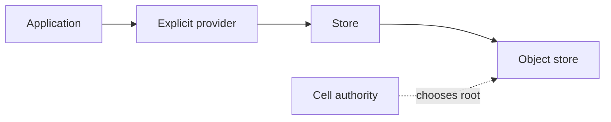

# cellule-store

Provider-neutral object transport for conditional writes, bounded reads,
immutable content, multipart upload, retries, and observation. Authority and
Cell ownership belong to `cellule-runtime`.



| Guide | Topic |
| --- | --- |
| [Transport contract](docs/transport.md) | Reads, writes, retries, multipart, and observation. |
| [Provider setup](docs/providers.md) | Credentials, scope, and capability probe. |
| [API](src/lib.rs) | Exports and feature gates. |

The caller supplies a validated prefix and provider. `cellule-ltx` defines
object paths; `cellule-runtime` conditionally selects an authoritative root.

```sh
cargo test -p cellule-store --features test-support --locked
```
