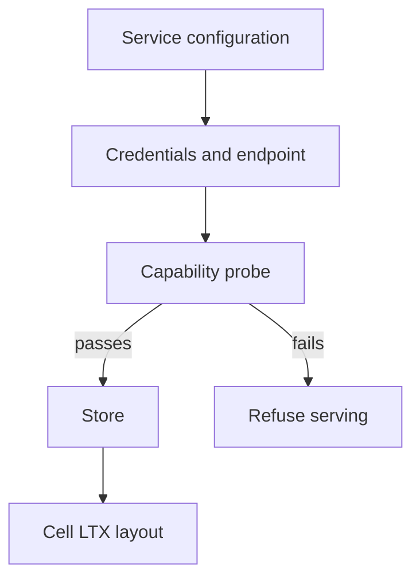

# Provider setup and scope

The embedding service owns credentials, endpoint choice, and authorization.
`build_explicit_store` constructs a provider when the service opts into
Cellule's builder. `probe_storage` checks the conditional-write and ranged-read
capabilities needed before serving a Cell.

| Boundary | Owner |
| --- | --- |
| Credentials and endpoint | Embedding service. |
| Provider-neutral transport | `cellule-store`. |
| Object layout and verified root | `cellule-ltx`. |
| Owner/head CAS and response gate | `cellule-runtime`. |

A failed probe must be handled before the host advertises readiness. Local
in-memory providers are useful for tests; production scope validation belongs
to the service. Start with [the embedding guide](../../../docs/embedding.md).
