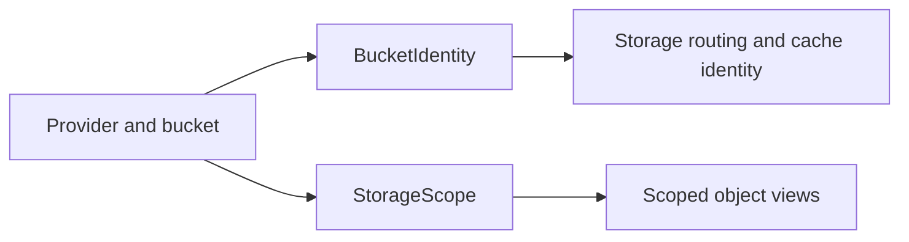

# cellule-types

Stable storage identities shared by Cellule crates. This crate does not construct
providers, select Cell owners, or access object storage.



| Start here | Topic |
| --- | --- |
| [Identity contracts](docs/identity.md) | Provider kinds, normalization, and storage scope. |
| [API](src/storage.rs) | Types and their tests. |
| [Framework architecture](../../docs/architecture.md) | Where identities sit in the crate graph. |

```sh
cargo test -p cellule-types --locked
```
