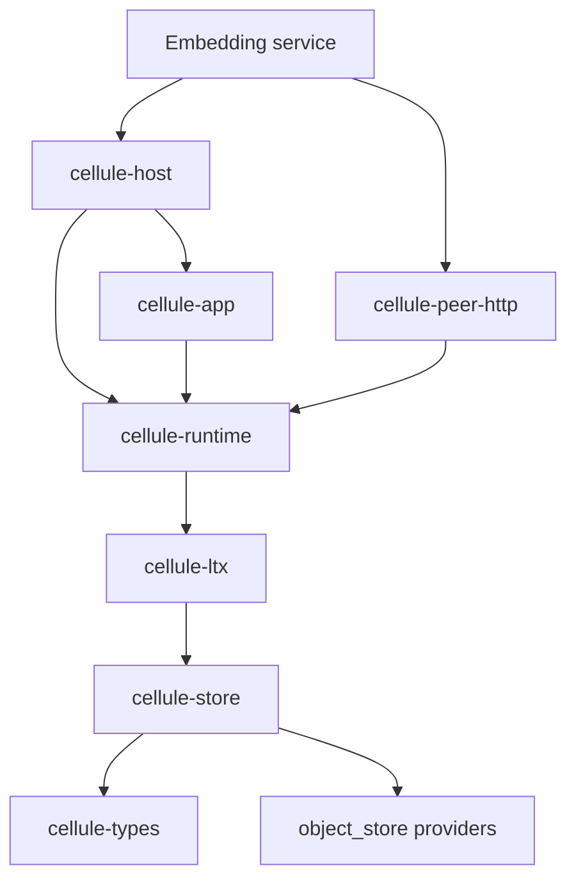

# Architecture and ownership

Cellule is a library framework. The host application supplies object-store implementations and credentials, node transport, authentication, routing, and deployment configuration. Cellule owns the mechanics that must be identical in every embedding product.




## Boundaries

- `cellule-types` owns stable, dependency-light provider and bucket identities.
- `cellule-store` wraps `object_store` for bounded reads, retries, compare-and-swap, immutable writes, and classified failures. It cannot decide which Cell root is authoritative.
- `cellule-ltx` owns SQLite WAL capture, LTX encoding and validation, exact restore, immutable root construction, and authenticated sparse pages. It returns a proposed root; it cannot acknowledge an application request.
- `cellule-runtime` owns stable identities, control transitions, owner fencing, release and catalog state, actors, durable request outcomes, primitive implementations, and root publication. One Cell command changes one SQLite database; cross-Cell work uses durable effects and idempotent inboxes.
- `cellule-app` compiles statically linked modules into a bounded application descriptor and author-facing handles. It cannot construct providers or take over a node.
- `cellule-peer-http` optionally implements owner routing, HTTP response classification, and pinned mTLS using runtime peer contracts. The service still owns receivers and application authorization.
- `cellule-host` owns exactly one runtime and the lifecycle of its registered facilities. It waits for drain and shutdown; the embedding service owns network and authorization policy.

## Persisted contracts

| Contract | Rule |
| --- | --- |
| Cell identity and partitioning | Stable across ownership changes; topology changes require review. |
| Control revisions and root references | Select state from authority, never from bucket order. |
| LTX data | Checksums and exact endpoint verification are mandatory. |
| Hash/signature domains | Preserve existing `crab.*.v1` domains. |
| CRB1 footer | Retain the `repository` key, whose value is a Cell ID. |
| Blob artifacts | Use `.cellule/blob-parts/` or the store's scoped prefix. |
| Framework descriptors | Use `cellule`, `cellule.application.v1`, and the `application` catalog role. |
| Peer schema | Use `cellule.peer.v1`; authenticate and authorize in the service. |

## Command durability

```mermaid
sequenceDiagram
    participant App as Typed application
    participant Actor as Cell owner
    participant SQL as Managed SQLite
    participant LTX as LTX and object store
    participant Authority as Control CAS
    App->>Actor: Command and stable request identity
    Actor->>SQL: Mutation and outcome in one transaction
    SQL-->>Actor: Committed WAL boundary
    Actor->>LTX: Prepare verified immutable root
    LTX-->>Actor: Proposed root
    Actor->>Authority: Publish exact root with owner fence
    alt CAS accepted
        Authority-->>Actor: Durable publication proof
        Actor-->>App: Result and receipt
    else Owner changed or reply ambiguous
        Actor-->>App: Fenced or unresolved outcome
    end
```

The diagram shows object durability. A configured follower-log mode uses a
recoverable follower proof before acknowledgement, then publishes to object
storage. Both modes use the same runtime output gate.

## Verification levels

Unit and integration tests are carried with each crate. The application reference test exercises all registered primitives against an in-memory object store. Production qualification also requires provider round trips, owner-loss recovery, process interruption, capacity, and cross-node tests in a dedicated environment. This repository does not claim that those external gates have passed.

The previous Cellule extraction is not an automatic storage upgrade path. See
[the synthesis ledger](synthesis.md) for the exact revision, retained identities,
and superseded APIs.
