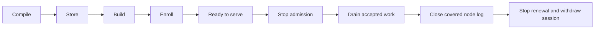
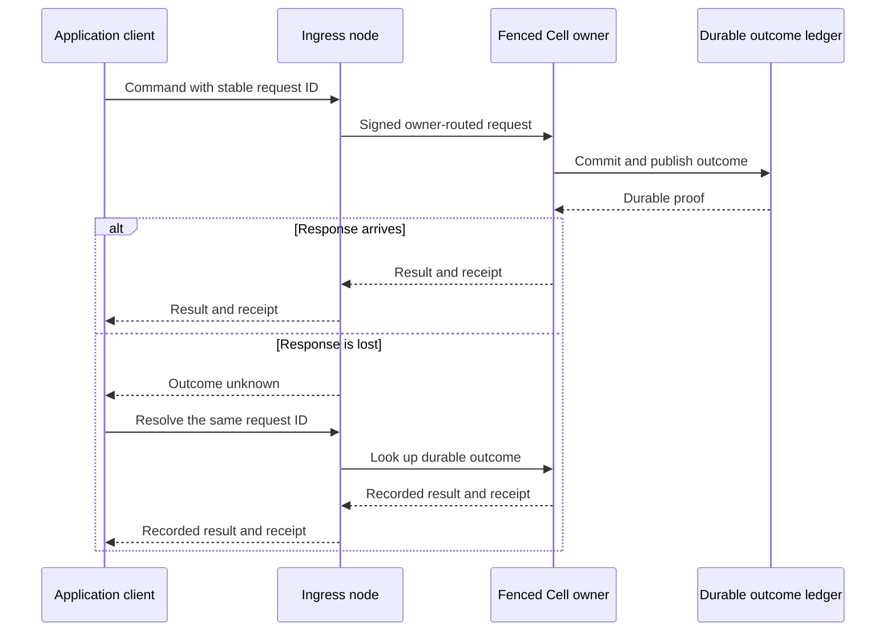

# Embed Cellule in a service

Cellule supplies reusable state and lifecycle mechanics. An application
owns ingress, authorization, cloud credentials, deployment configuration, and
fleet policy. Start with the [orders example and application integration suite](quickstart.md).

## Assemble one node

| Step | Action | Boundary |
| --- | --- | --- |
| Compile | Register modules, schemas, and stable IDs in `CellApplication`. | `BuildDescriptor` pins source and lockfile digests. |
| Store | Construct `Store` and `CellStorageLayout`; provision the tenant catalog. | Credentials remain in the service. |
| Build | Configure one `CellNodeBuilder` with runtime, replica host, and session. | Memory, disk, and jobs have explicit limits. |
| Enroll | Publish the signed node session; install its lease and renewal task. | Use `spawn_lease_maintenance` for renewal. |
| Serve | Install routing and owned facilities; call `start()`. | External readiness also checks provider, release, and listener state. |

Before admitting traffic, run `cellule_store::probe_storage` on a fresh private
prefix in the configured store. Inspect `StorageProbeReport::passed` and
`failed_checks` to reject providers that cannot honor conditional create,
ETag update, stale-ETag rejection, and exact ranged reads. Readiness policy stays
in the application; the host does not implicitly run a credentialed probe.

`build_unleased_for_maintenance()` is for bounded offline work. It is not a
serving-node initialization path.

## Peer transport

`cellule-peer-http` is an optional adapter above the runtime. It supplies
`PeerHttpRoundTrip`, pinned mTLS clients, and an mTLS listener; it does not
install a public route or authorize application users.

The service supplies a `PeerTargetScope`, loads the local identity with
`LoadedPeerTls::load`, and wires `PeerHttpRoundTrip` into a signed `CellClient`.
The incoming route must authenticate the enrolled peer, verify the signed
request, enforce application authorization, and dispatch with `PeerDispatcher`.
Read the [transport contract](../crates/cellule-peer-http/README.md) before
implementing that receiver, especially its 429/503 admission semantics.

Both owner-routed and direct-node requests reject an oversized body or exhausted
deadline before dispatch. A lost or invalid response remains an unknown outcome.
The receiver and caller must not infer that a mutation failed merely because its
HTTP response was lost.

Resolve an ambiguous response using the original request ID. Creating a new ID
would ask the owner to execute a second command.

## Read replicas and delivery

Use the [host's read-replica manager and recruitment API](../crates/cellule-host/README.md)
for selected immutable snapshots, refresh, eviction, and fenced warm promotion.
Native-memory reservations for snapshots are separate from writer capacity;
configure `SqlWorkerPool::with_native_memory_limit` explicitly. Queries do not
activate missing readers or bypass their admission policy.

Activities and Effects retain their runtime supervisors. The application
owns which supervisors to start, their schedules, and their cancellation through
the node task group. The old framework-wide automatic delivery loop is superseded
by the current host lifecycle.

## Drain and shutdown

`CellNode` owns exactly one runtime. Shutdown first stops admission and joins
work producers while lease maintenance remains live. It drains accepted work
and the covered node log, then cancels node shutdown and joins lease maintenance
before releasing the session. All phases share the shutdown deadline.

Scale-down and shutdown serialize through one drain lane. A caller's deadline
bounds the releases it starts; it does not bound waiting for that lane. Fleet
movement budgets belong to the planner. Keep service readiness and session
withdrawal in the same lifecycle as the host.
