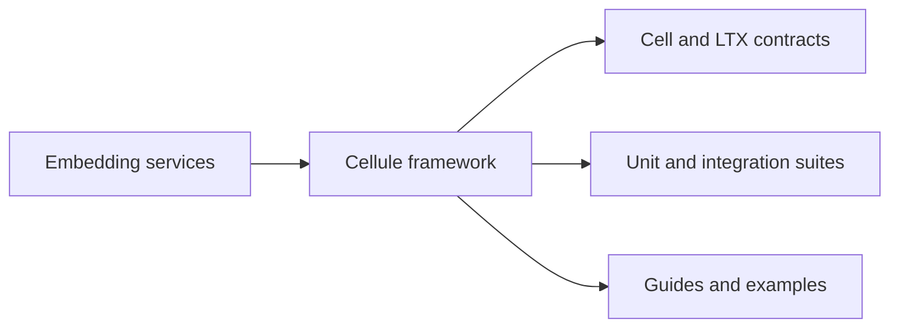

# Historical Cellule import record

This workspace synthesizes reusable Cell and LTX infrastructure from
[Crab](https://github.com/crabbuild/crab). Crab was the source for this one-time import. **Cellule now owns all Cell
framework code and contracts.** Changes are made and reviewed here; there is
no upstream parity gate or automatic re-import.

| Field | Value |
| --- | --- |
| Source revision | `beb439039cb37e750afe6625a2358101c70d1191` |
| Source change | `test(cell): add writable entity fleet qualification and fencing diagnostics (#499)` |
| Previous Crab extraction | `3ab25264` |
| Cellule checkout before refresh | `56b35ab` |
| PR base (`main`) | `8c3ed49` |
| Refresh date | 2026-09-27 |

## Mapping

| Crab | Cellule |
| --- | --- |
| `crab-cell-runtime` | `cellule-runtime` |
| `crab-cell-app` | `cellule-app` |
| `crab-cell-host` | `cellule-host` |
| `crab-cell-peer-http` | `cellule-peer-http` (new optional transport adapter) |
| `crab-ltx` | `cellule-ltx` |

The existing `cellule-types` and provider-neutral `cellule-store` remain the
lower boundary. Git pack layout, Crab provider configuration, product servers,
and their dependencies are not imported. The store's capability probe remains
available to embedding services.

## What changed

| Surface | Current Crab capability adopted |
| --- | --- |
| Runtime | Subsystem modules; bounded catalog/due work; pressure sampling and shedding; read replicas; fenced promotion; owner-loss handling; entity topology. |
| LTX | Capture durability; sparse recovery; pinned uploads; error classification; external decoder vectors; fuzz targets. |
| Host | Task ownership; lease-preserving drain; durability supervision; read-replica recruitment. |
| Public API | Small root prelude; other public types under their owning module; no former flat-surface aliases. |
| Tests | Capability suites; API/test inventories; pure coordination kernel and documented-path checks. |

The product policy entry-point inventory stays in Crab: it scans embedding-server
callers. Cellule's boundary check verifies the standalone crate graph.

## Deliberate adaptations

- Package and Rust identifiers use `cellule-*` and `cellule_*`.
- LTX's public error remains `LtxError`.
- Application descriptors retain `cellule.application.v1`, release descriptors
  name `cellule`, the generic catalog role is `Application`/`application`, and
  generated protobuf uses `cellule.peer.v1`.
- Existing `crab.*.v1` hash/signature domains and the CRB1 footer's `repository`
  key remain unchanged. Blob parts retain `.cellule/blob-parts/`, and the store
  retains its existing endpoint-identity hash domain.
- Runtime `test-support` now owns the current filesystem CAS fixture and movement
  probe. The old store-side copy and `process-test-support` feature are removed.
- Test/performance environment variables use `CELLULE_*`; LTX-specific knobs
  use `CELLULE_LTX_*`. The standalone performance runner lives at `perf/cellule`.
- Links to Crab-only plans and evidence point to the pinned upstream revision.
  Upstream evidence is provenance, not a claim that this extraction passed it.
- Owner and direct-node HTTP routes share byte and deadline admission checks.
  New transport tests cover both routes and actual HTTP response classification.

## Superseded Cellule additions

This is a pre-release hard cut to Crab's feature set.

| Superseded Cellule addition | Current supported surface |
| --- | --- |
| Timer primitive | Workflow timers and Cron. |
| Projection API | SQL and typed application queries. |
| Hosted Queue consumer | Queue leases and application-owned processing. |
| Automatic host delivery loop/status | Explicit Activity/Effect supervisors. |
| Extra primitive simulators and aggregate Workflow/Effect queries | Current Crab primitives, query APIs, and capability tests. |

Reintroducing these APIs requires integration with the current actor, capacity,
maintenance, registry, and host contracts.

The orders example was adapted to the current public API during the import.
The current workspace also registers the application descriptor and attachments
examples; the [quickstart](quickstart.md) shows all three. The old reference
application now lives in the `integration` test suite.

Catalog layout, descriptors, and authority behavior have evolved since the old
extraction. This refresh does not assert that an old deployment can open its
existing object prefix without migration. Validate persisted state and signed
peer compatibility before switching an existing service. No published Cellule
release tags existed in the destination at refresh time.

## Ownership after the import

The source revision and import adaptations above are historical evidence.
They do not define a second implementation to follow. Review future behavior
changes in Cellule, including callers, tests, persistence contracts, and docs.
The previous source-comparison workflow and adaptation patch were retired.
The [original synthesis ledger](synthesis-ledger-2026-09.md) remains available
for its full mapping and verification history.

The local LTX test adaptation removes fault expectations for placeholder fsyncs
that Crab deliberately removed in `311105eb864` (`#469`). Creation failure,
existing-file preservation, retry, and drop cleanup remain tested; publication
and warm-reuse durability barriers are unchanged.

## Verification

The [refresh verification report](verification.md) records actual results and
remaining qualification limits. Run the gates in `CONTRIBUTING.md` and `.github/workflows/rust.yml`. The primary
end-to-end paths are the orders example, typed primitive/recovery scenario,
public-host tests, and the balanced three-process reference smoke. Provider,
constrained Linux fleet, fault, fuzz-search, and cross-platform claims require
their separate environments; do not infer them from a successful compilation.
