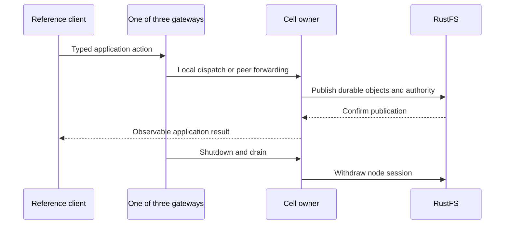

# Synthesis verification — 2026-09-27

Historical import source: `beb439039cb37e750afe6625a2358101c70d1191`.
Cellule base: `56b35ab`. This dated report records verification of that import
revision; current qualification routes are in the
[delivery evidence guide](../crates/cellule-runtime/docs/delivery.md).

## Environment

| Component | Environment |
| --- | --- |
| Rust | 1.97.0, macOS ARM64. |
| Broad Rust tests | Isolated source snapshot and separate target directory on the mounted workspace volume. |
| Object storage | Disposable local RustFS container, pinned `1.0.0-glibc` image; isolated bucket and prefix. |
| Coordination model | Linux container, pinned TLC toolchain from `model/toolchain.env`. |

## Results

| Proof | Result |
| --- | --- |
| Historical import parity | 504 files match after mechanical naming and the reviewed adaptation patch; shared dependency contracts match. |
| Drift checker failure cases | Rejects changed source, leftover modules, changed workspace dependencies, and adaptation conflicts. |
| All targets/features | `cargo check --workspace --all-targets --all-features --locked` passed. |
| Workspace tests | `cargo test --workspace --all-features --locked --no-fail-fast` passed; 33 ignored test results require separate environments or explicit selection. |
| Local-only LTX | `cargo test -p cellule-ltx --no-default-features --locked` passed. |
| Strict lints and API docs | All-target/all-feature Clippy and rustdoc with `-D warnings` passed. |
| Authoring and orders examples | Descriptor construction passed; orders committed and read back `1999` cents for order `42`. |
| Three-process RustFS smoke | Passed; every gateway served local and forwarded requests; shutdown withdrew sessions and drained readers. |
| HTTP transport | Five tests passed, including request limits, zero deadlines, actual HTTP retry responses, and TLS material validation. |
| Coordination simulation | Explicit seed `41`, 256 steps, passed through the renamed environment controls. |
| TLC fast profile | Safety and liveness passed; four negative models produced the expected violations. |
| Qualification harness | 16 Python tests passed. |
| Documentation | 68 Rust fences passed syntax checks; packaged application guide passed its doctest. |
| Boundaries and contracts | Crate boundaries, LTX/runtime layout, SQL schemas, and peer contract validation passed. |
| Packaging inventory | Workspace package file listing passed; this is not a publish or installed-package test. |

## End-to-end path exercised



The exact smoke selector is:

```text
reference_application::process_performance::reference_balanced_three_process_fleet_end_to_end_performance
```

That selector records the test name at the import revision. The current suite is
named `integration`; its corresponding selector is
`process_performance::reference_balanced_three_process_fleet_end_to_end_performance`.
The Rust workflow asserts the current selector before running it, so a rename
cannot silently produce a successful zero-test smoke run.

## Scope of evidence

- The RustFS run proves local multi-process integration, not production cloud
  latency or the constrained Linux fleet performance thresholds.
- The Linux container ran TLC; the Rust suite ran on macOS. Linux Rust CI and
  cross-platform qualification remain to be run after publication of the branch.
- Full fault campaigns, long fuzz searches, cloud-provider matrices, production
  mTLS deployment, and old persisted-data upgrades are not claimed here.
- This report records checks completed before PR publication. Remote CI results
  are reported separately on the PR; no release was performed.
- Imported dated performance reports retain their upstream provenance; they are
  not fresh Cellule benchmark results.

## Reproduce current checks

Use [CONTRIBUTING.md](../CONTRIBUTING.md) for local checks and
[the Rust workflow](../.github/workflows/rust.yml) for the isolated RustFS service,
bucket setup, environment, and exact process-smoke command.

```sh
python3 scripts/check-boundaries.py
python3 scripts/check-module-layout.py
python3 scripts/check-doc-rust-fences.py
node crates/cellule-runtime/docs/validate.mjs
```
