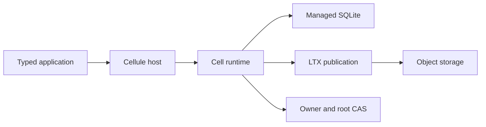

# Cellule

> Original workspace overview from the Crab-to-Cellule synthesis. The
> [current README](../README.md) is the maintained entry point; service-specific
> details below are historical.


Cellule is an embedded Rust framework for SQLite-backed distributed Cells.
Each Cell has one fenced writer, durable authority, immutable LTX history, and
an exact recovery root. Services supply ingress, authorization, and credentials.




The source repository is public. The crates publish to crates.io as a matched
`cellule-*` set; see the [release guide](../docs/releasing.md) for the packaging
and publish order. Until the first release is cut, run the examples from this
workspace checkout.

## Crates

| Layer | Crate | Responsibility |
| --- | --- | --- |
| Contracts | [cellule-types](../crates/cellule-types/README.md) | Dependency-light provider and bucket identities shared across storage boundaries. |
| Transport | [cellule-store](../crates/cellule-store/README.md) | Provider-neutral object-store operations, conditional writes, retries, and error classification. |
| Persistence | [cellule-ltx](../crates/cellule-ltx/README.md) | Managed SQLite WAL capture, verified LTX recovery, immutable Cell roots, and sparse reads. Remote replication requires the `replica` feature. |
| Coordination and execution | [cellule-runtime](../crates/cellule-runtime/README.md) | Cell identities, owner fencing, authority CAS, SQL execution, durable outcomes, and distributed primitives. |
| Application | [cellule-app](../crates/cellule-app/README.md) | Module registration, stable topology, and typed author handles. |
| Peer transport | [cellule-peer-http](../crates/cellule-peer-http/README.md) | Optional owner-resolving HTTP transport and pinned mTLS; the service owns ingress and authorization. |
| Host | [cellule-host](../crates/cellule-host/README.md) | One-runtime node lifecycle, resource admission, drain, and shutdown. |

The dependencies point downward: `host → app → runtime → ltx → store → types`. `host` also uses runtime directly. No crate depends on Crab or Git. The optional peer HTTP adapter depends on runtime contracts and HTTP/TLS libraries; lower layers remain transport-neutral.

## How a write becomes durable

1. The current owner executes a command through the managed SQLite writer and records its outcome in the same transaction.
2. LTX captures the committed WAL boundary and prepares immutable, verified objects.
3. The runtime conditionally publishes an exact root in the Cell control record. A conflict fences a stale owner.
4. A successful response follows the durable publication or the configured, recoverable follower-log path.

Recovery begins from the authority-pinned root and verifies the referenced data before activating a Cell. A bucket listing never selects authoritative state.

## Develop

Rust 1.97 or newer is required:

```sh
cargo check --workspace --locked
cargo test --workspace --locked
cargo test -p cellule-ltx --features replica --locked
```

Start with the [orders example and application integration guide](../docs/quickstart.md).
The orders example commits and reads a published SQL value. The reference
application exercises SQL, KV, Blob, Queue, Workflow/Activity, and Cron/Effect,
then restores published state under a successor owner. See [architecture](../docs/architecture.md),
[embedding](../docs/embedding.md), [qualification](../crates/cellule-runtime/qualification/README.md),
and [performance scenarios](../crates/cellule-app/PERFORMANCE.md).
LTX retains its [upstream attribution](../crates/cellule-ltx/UPSTREAM.md) and licenses.

## Integration

Cellule is developed and tested as a separate workspace. A service supplies its own storage provider, application modules, network transport, and authentication. The architecture document defines the crate boundaries, and the [runtime design notes](../crates/cellule-runtime/docs/README.md) carry the mechanics that were synthesized from Crab.

The [primitive roadmap](../docs/roadmap.md) records the supported framework surface and remaining integration and qualification work.

## Contribute

See [CONTRIBUTING.md](../CONTRIBUTING.md) for local setup, verification, and compatibility rules.
